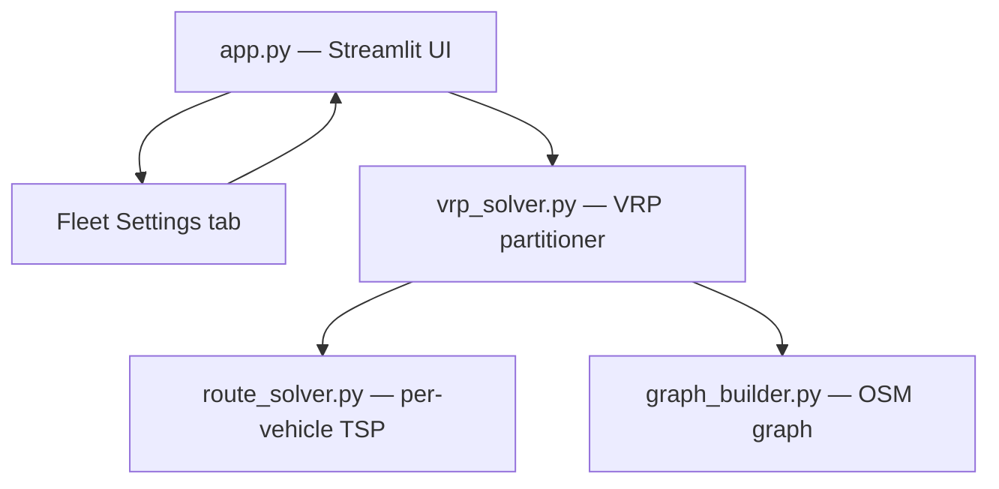

# System Design & Architecture

## Architecture Overview



- **`app.py`** — adds a dedicated "Fleet Settings" tab for fleet configuration, a multi-vehicle results section after optimisation, and `build_vrp_result_map()` for rendering the multi-vehicle Folium map.
- **`vrp_solver.py`** (new) — two-phase VRP: assigns stops to mode pools, then k-means clusters within each mode's vehicles, then calls `route_solver.solve_tsp()` per vehicle.
- **`route_solver.py`** — unchanged; called once per vehicle with that vehicle's stop subset.
- **`graph_builder.py`** — unchanged; the three modal graph copies are reused across all vehicles.
- **`visualizer.py`** — unchanged; single-vehicle map rendering is unmodified.

## Data Models

### `Vehicle` (dataclass — top of `vrp_solver.py`)
```python
@dataclass
class Vehicle:
    name: str               # e.g. "Van 1"
    mode: str               # "drive" | "bike" | "walk"
    capacity: int           # max stops this vehicle can serve
    color: str = ""         # hex colour for map rendering, auto-assigned
```

### Fleet configuration (session state key: `fleet`)
```python
st.session_state["fleet"] = List[Vehicle]
```

### VRP result
```python
@dataclass
class VehicleRoute:
    vehicle: Vehicle
    stops: list             # ordered DeliveryStop sequence in visit order (depot excluded)
    tsp_route: list         # closed OSM node tour: [depot_node, n1, …, depot_node]
    full_route: list        # expanded OSM node sequence for map polyline rendering
    total_time_s: float
    total_dist_m: float
    legs: list              # LegInfo list; populated by run_vrp_optimization() in app.py
    skipped_stops: list     # kept for API compatibility
```

### Stop-to-vehicle assignment
Internally two structures:
- `mode_stop_pool: dict[mode -> List[stop]]` — output of Phase 1
- `dict[vehicle.name -> List[stop]]` — output of Phase 2 per-mode distribution

## API Design

### `vrp_solver.py` public interface

```python
def solve_vrp(
    stops: list,            # List[DeliveryStop] — all delivery stops (node_id set)
    depot,                  # DeliveryStop — start/end point (node_id set)
    fleet: list,            # List[Vehicle] — vehicles with mode and capacity
    graphs: dict,           # {"drive": G, "bike": G, "walk": G}
    tsp_method: str = "auto",
) -> tuple[list, list]: ...
# Returns (routes: List[VehicleRoute], warnings: List[str])
```

Internal call chain:

**Phase 1 — mode assignment:**
1. `_check_reachable(stop, depot, graphs)` — Dijkstra shortest-path cost < PENALTY → returns set of reachable modes
2. `_assign_stops_to_modes(stops, fleet, depot, graphs)` — assigns each stop to the mode pool with the most remaining capacity among compatible modes; returns `(mode_stop_pool, unreachable)`

**Phase 2 — intra-mode distribution + TSP:**
3. `_distribute_within_mode(stops, vehicles, depot)` — k-means geographic clustering scoped to one mode's vehicles + capacity rebalancing → `dict[vehicle.name, List[stop]]`
4. `_solve_per_vehicle(vehicle, cluster, depot, graphs, tsp_method)` — builds per-vehicle modal distance matrix, calls `solve_tsp()`, reconstructs `tsp_route` and `full_route` (round-trip: depot → stops → depot)

### `_distribute_within_mode` algorithm (k-means + capacity rebalancing)

```
1. k = min(len(vehicles), len(stops))
2. Run KMeans(n_clusters=k, n_init=10, random_state=42) on stop (lat, lon) coordinates
3. Sort cluster centroids by compass bearing from depot
4. Assign clusters to vehicles by bearing order
5. Capacity rebalancing: if a vehicle exceeds capacity, pop excess stops and
   insert into the next vehicle (forward scan, then backward) with remaining capacity
6. Raise ValueError if all vehicles are full before all stops are placed
```

### Multi-vehicle map rendering (in `app.py`)

```python
def build_vrp_result_map(
    mode_graphs: dict,
    vrp_routes: List[VehicleRoute],
    depot,
) -> folium.Map: ...
```

Iterates `vrp_routes`, creates one `FeatureGroup` per vehicle with an `AntPath` polyline in the vehicle's colour, adds numbered stop markers coloured per vehicle, and adds a depot marker.

## Component Breakdown

### New: `vrp_solver.py`
- `Vehicle`, `VehicleRoute` dataclasses
- `VEHICLE_COLORS` — 10-colour qualitative palette (ColorBrewer Set1)
- `solve_vrp()` — main entry point; returns `(List[VehicleRoute], List[str])`
- `_check_reachable()` — Dijkstra reachability check per stop per mode
- `_assign_stops_to_modes()` — Phase 1 mode-pool assignment
- `_distribute_within_mode()` — Phase 2 k-means + capacity rebalancing
- `_solve_per_vehicle()` — builds per-vehicle distance matrix + calls TSP
- `_bearing()` — compass bearing helper for centroid sorting

### Modified: `app.py`
- New "Fleet Settings" tab: add / remove / edit vehicles (name, mode, capacity) using manual `st.columns` form per vehicle
- Session state init: `st.session_state["fleet"]` with a default single-vehicle entry on first load
- `build_vrp_result_map()` — multi-vehicle Folium map renderer (one `FeatureGroup` + `AntPath` per vehicle)
- `run_vrp_optimization()` — pipeline: snap nodes → validate → build graphs → solve VRP → populate `legs`
- Fleet of 1 vehicle: routes through the original `run_optimization()` single-vehicle path (unchanged behaviour)
- Fleet of 2+ vehicles: routes through `run_vrp_optimization()` → `solve_vrp()`
- Per-vehicle metric cards + expanders shown after optimisation
- `st.warning()` for skipped/idle stops, `st.error()` for over-capacity or routing failure

### Unchanged
- `graph_builder.py` — graph already returns modal copies usable by all vehicles
- `route_solver.py` — called once per vehicle as-is; `PENALTY` imported directly
- `visualizer.py` — single-vehicle map rendering unchanged

## Design Decisions

| Decision | Choice | Rationale |
|---|---|---|
| VRP algorithm | Mode-first two-phase (assign to mode pools → k-means within mode) | Guarantees mode compatibility before clustering; eliminates silent failures where a stop is clustered to a vehicle whose mode cannot reach it |
| Capacity rebalancing | Post-k-means greedy overflow with forward+backward scan | K-means ignores capacity; bidirectional scan prevents false over-capacity errors on the last vehicle |
| Per-vehicle TSP | Reuse existing `solve_tsp()` | Zero code duplication; inherits auto-method selection (nn/2opt/genetic) |
| Route type | Round-trip — `tsp_route[0] == tsp_route[-1] == depot_node` | Requirements decision Q1; consistent with existing single-vehicle TSP behaviour |
| Mode compatibility | PENALTY check via Dijkstra per stop; incompatible stops returned as `unreachable` list | Requirements decision Q4; consistent with existing `audit_reachability()` semantics |
| Fleet UI location | Dedicated "Fleet Settings" tab in main area | Requirements decision Q3; keeps sidebar clean |
| Fleet persistence | `st.session_state` only (no `cache/fleet.json`) | Survives widget re-renders; cross-session disk persistence deferred |
| Colour assignment | Fixed 10-colour qualitative palette in `vrp_solver.VEHICLE_COLORS`, assigned at vehicle-creation time | Perceptually distinct, colourblind-friendly; stable across re-renders |
| Map rendering location | `build_vrp_result_map()` in `app.py` (not `visualizer.py`) | Keeps VRP-specific rendering co-located with VRP orchestration; `visualizer.py` remains a single-vehicle concern |
| AntPath for all vehicles | `AntPath` used for all vehicle routes | Consistent animated style; DOM weight acceptable for fleet sizes ≤ 20 |
| New dependency | `scikit-learn` (for `KMeans`) | Already a common Python data science package; added to `requirements.txt` |

## Non-Functional Requirements

- **Performance**: partitioning + TSP for 3 vehicles × 20 stops must complete in < 5 s on a cached OSM graph.
- **Scalability**: designed for fleets up to ~20 vehicles and ~100 stops; k-means degrades gracefully beyond that.
- **Reliability**: idle vehicles (0 stops) are skipped with an info warning. Over-capacity fleet raises `ValueError` surfaced as `st.error()`. Unreachable stops are listed in `st.warning()` and skipped.
- **Backward compatibility**: fleet of 1 vehicle routes through the original single-vehicle flow — identical output to pre-VRP behaviour.
- **Security**: no external API calls introduced; no fleet config written to disk in current implementation.
