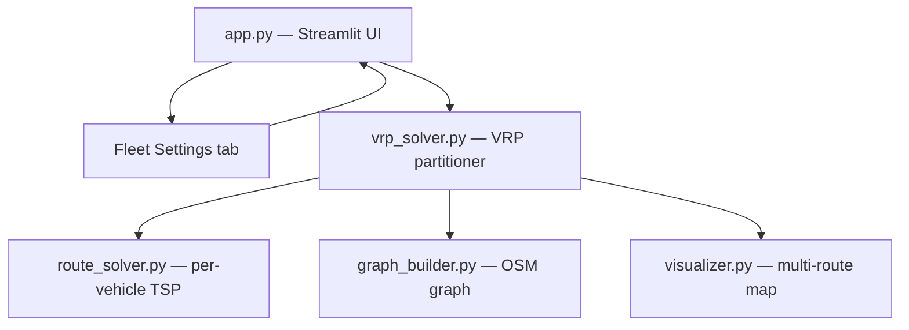

# System Design & Architecture

## Architecture Overview



- **`app.py`** — adds a dedicated "Fleet Settings" tab for fleet configuration, and a multi-vehicle results section after optimisation.
- **`vrp_solver.py`** (new) — clusters stops across vehicles using k-means geographic clustering (with capacity rebalancing), then calls `route_solver.solve_tsp()` for each vehicle.
- **`route_solver.py`** — unchanged; called once per vehicle with that vehicle's stop subset.
- **`graph_builder.py`** — unchanged; the three modal graph copies are reused across all vehicles.
- **`visualizer.py`** — extended: `draw_route()` helper extracted from `build_map()`, then `draw_multi_vehicle_routes()` calls it per vehicle with colour injection.

## Data Models

### `Vehicle` (dataclass — top of `vrp_solver.py`)
```python
@dataclass
class Vehicle:
    name: str               # e.g. "Van 1"
    mode: str               # "drive" | "bike" | "walk"
    capacity: int           # max stops this vehicle can serve
    color: str              # hex colour for map rendering, auto-assigned
```

### Fleet configuration (session state key: `fleet`)
```python
st.session_state["fleet"] = List[Vehicle]
```

### VRP result
```python
@dataclass
class VehicleRoute:
    vehicle: Vehicle
    stops: List[Location]       # ordered stop sequence (depot not included)
    node_path: List[int]        # OSM node IDs for the full path; depot node
                                # is both first and last element (round-trip)
    total_time_s: float
    total_distance_m: float
```

### Stop-to-vehicle assignment
Internally a `dict[str, List[Location]]` mapping `vehicle.name → [stops]`, built by the clustering step.

## API Design

### `vrp_solver.py` public interface

```python
def solve_vrp(
    stops: List[Location],
    depot: Location,
    fleet: List[Vehicle],
    graphs: Dict[str, nx.MultiDiGraph],   # {"drive": G, "bike": G, "walk": G}
    method: str = "auto",
) -> List[VehicleRoute]: ...
```

Internal call chain:
1. `_cluster_stops(stops, fleet, depot)` — k-means geographic clustering + capacity rebalancing → `dict[vehicle_name, List[Location]]`
2. `_filter_mode_compatible(vehicle, cluster, depot, graphs)` — removes stops unreachable by the vehicle's mode (PENALTY check), collects warnings
3. `_solve_per_vehicle(vehicle, cluster, depot, graphs, method)` — builds per-vehicle modal distance matrix, calls `solve_tsp()`, reconstructs full node path (round-trip: depot → stops → depot)

### `_cluster_stops` algorithm (k-means + capacity rebalancing)

```
1. Run sklearn.cluster.KMeans(n_clusters=k) on stop (lat, lon) coordinates,
   where k = min(len(fleet), len(stops))
2. Assign each cluster to the vehicle with compatible mode and remaining capacity
   (round-robin over fleet by ascending cluster centroid bearing from depot)
3. If any vehicle exceeds capacity, move excess stops to the next vehicle
   with remaining capacity and compatible mode
4. If all vehicles are at capacity before all stops are assigned → raise ValueError
```

### Extended `visualizer.py`

```python
# New helper extracted from build_map()
def draw_route(
    feature_group: folium.FeatureGroup,
    node_path: List[int],
    G: nx.MultiDiGraph,
    color: str,
    label: str,
) -> None: ...

# New multi-vehicle entry point
def draw_multi_vehicle_routes(
    m: folium.Map,
    vehicle_routes: List[VehicleRoute],
    depot_node: int,
    G_base: nx.MultiDiGraph,
) -> folium.Map: ...
```

`draw_multi_vehicle_routes` iterates `vehicle_routes`, creates one `FeatureGroup` per vehicle, calls `draw_route()` with the vehicle's colour, and adds a vehicle-labelled popup on route segments and stop markers.

## Component Breakdown

### New: `vrp_solver.py`
- `Vehicle`, `VehicleRoute` dataclasses
- `solve_vrp()` — main entry point
- `_cluster_stops()` — k-means geographic clustering with capacity rebalancing
- `_filter_mode_compatible()` — PENALTY-based reachability filter, collects skipped stops
- `_solve_per_vehicle()` — builds per-vehicle distance matrix + calls TSP

### Modified: `app.py`
- New "Fleet Settings" tab: add / remove / edit vehicles (name, mode, capacity) using `st.data_editor` or form
- Session state init: `st.session_state["fleet"]` with a default single-vehicle entry on first load
- Optional persistence: serialise fleet to `cache/fleet.json` on change, load on startup
- Replace single-route results section with per-vehicle expanders (stop list, distance, time)
- Validate fleet before optimisation: total capacity >= number of stops

### Modified: `visualizer.py`
- Extract `draw_route(feature_group, node_path, G, color, label)` from `build_map()`
- Add `draw_multi_vehicle_routes(m, vehicle_routes, depot_node, G_base)`
- 10-colour qualitative palette constant: `VEHICLE_COLORS = ["#e41a1c", "#377eb8", ...]`
- Existing `build_map()` refactored to call `draw_route()` internally (no behaviour change)

### Unchanged
- `graph_builder.py` — graph already returns modal copies usable by all vehicles
- `route_solver.py` — called once per vehicle as-is; `PENALTY` imported directly

## Design Decisions

| Decision | Choice | Rationale |
|---|---|---|
| VRP algorithm | K-means geographic + per-vehicle TSP (cluster-first, route-second) | Geographically coherent clusters; minimal solver dependency; k-means in sklearn (new dep) |
| Capacity rebalancing | Post-k-means greedy overflow reassignment | K-means ignores capacity; overflow rebalancing ensures constraints are respected |
| Per-vehicle TSP | Reuse existing `solve_tsp()` | Zero code duplication; inherits auto-method selection (nn/2opt/genetic) |
| Route type | Round-trip — depot node is first and last in `node_path` | Requirements decision Q1; consistent with existing single-vehicle TSP behaviour |
| Mode compatibility | PENALTY check per stop; incompatible stops skipped with `st.warning()` | Requirements decision Q4; consistent with existing `audit_reachability()` semantics |
| Fleet UI location | Dedicated "Fleet Settings" tab in main area | Requirements decision Q3; keeps sidebar clean |
| Fleet persistence | `st.session_state` + optional `cache/fleet.json` | Survives widget re-renders; optional disk persistence for cross-session memory |
| Colour assignment | Fixed 10-colour qualitative palette (ColorBrewer Set1), assigned at vehicle-creation time | Perceptually distinct, colourblind-friendly; stable across re-renders |
| New dependency | `scikit-learn` (for `KMeans`) | Already a common Python data science package; must be added to `requirements.txt` |

## Non-Functional Requirements

- **Performance**: partitioning + TSP for 3 vehicles × 20 stops must complete in < 5 s on a cached OSM graph.
- **Scalability**: designed for fleets up to ~20 vehicles and ~100 stops; k-means degrades gracefully beyond that.
- **Reliability**: vehicles with 0 stops after clustering are skipped silently. Over-capacity fleet raises `ValueError` surfaced as `st.error()`. Unreachable stops are listed in `st.warning()` and skipped.
- **Backward compatibility**: fleet of 1 vehicle must produce identical output to the current single-vehicle flow.
- **Security**: no external API calls introduced; fleet config written only to local `cache/` directory.
